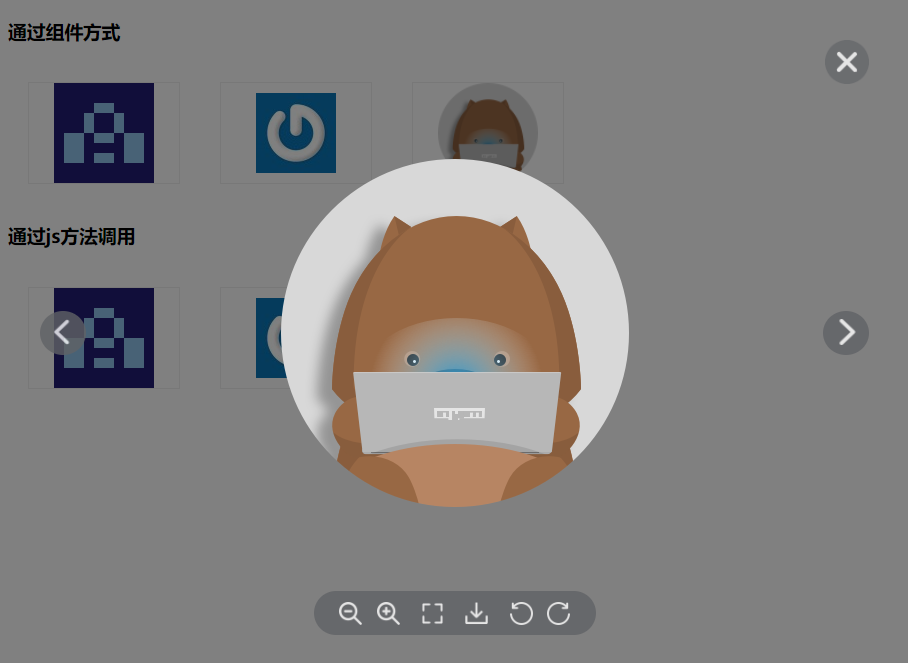

# vue-img-viewr

[](https://www.npmjs.com/package/vue-img-viewr/v/1.0.4)

> ❗ vue图片查看组件（vue image viewer component），```1.x```版本为```vue@2.x```组件  

> ❗ 如需在```vue@3.x```中使用，请使用 [](https://www.npmjs.com/package/vue-img-viewr)， Github v2.x地址 [](https://github.com/jekorx/vue-img-viewr)  
> ```yarn add vue-img-viewr@^2.0.1```  
> ```npm i vue-img-viewr@^2.0.1 -S```  

### 示例

> [demo展示](https://jekorx.github.io/vue-img-viewr)  



### 用法

```bash
# 安装依赖
yarn add vue-img-viewr@^1.0.5
# or
npm i vue-img-viewr@^1.0.5 -S
```

> 使用，SPA，非SSR  

```javascript
/**
 * 一、推荐🔥全局js方式引入
 */
import Vue from 'vue'
import { showImages } from 'vue-img-viewr'
import 'vue-img-viewr/styles/index.css'

Vue.prototype.$showImages = showImages

/** 使用 **/
this.$showImages({
  urls: this.urls,
  index
})

/**
 * 二、按需引入使用
 */
import ImgViewr, { showImages } from 'vue-img-viewr'
import 'vue-img-viewr/styles/index.css'

export default {
  // 注册组件
  components: { ImgViewr },
  data () {
    return {
      urls: [
        'https://s.gravatar.com/avatar/221f86a573320174bad7a62886a6d4b4?size=100&default=retro',
        'https://s.gravatar.com/avatar/221f86a573320174bad7a62886a6d4b4',
        'https://static.npmjs.com/attachments/ck3uwf5d872zb8874c3ayi1pj-icon-pro-wombat-3x.png'
      ],
      index: 0,
      visible: false
    }
  },
  methods: {
    // 通过组件方式
    showImagesByComponent (index) {
      this.visible = true
      this.index = index
    },
    showImagesByJs (index) {
      // 通过js方式显示
      showImages({
        urls: this.urls,
        index
      })
    }
  }
}
```

> 服务端渲染（SSR）中使用，以Nuxtjs为例  

```javascript
/**
 * 引用
 */
// @/plugins/vue-img-viewr.js
import Vue from 'vue'
import ImgViewr, { showImages } from 'vue-img-viewr'
import 'vue-img-viewr/styles/index.css'

export default () => {
  // 全局方法
  Vue.prototype.$showImages = showImages
  // 注册组件
  Vue.component(ImgViewr.name, ImgViewr)
}

// nuxt.config.js
plugins: [
  { src: '@/plugins/vue-img-viewr', ssr: false }
]

/**
 * 使用
 */
export default {
  data () {
    return {
      urls: [
        'https://s.gravatar.com/avatar/221f86a573320174bad7a62886a6d4b4?size=100&default=retro',
        'https://s.gravatar.com/avatar/221f86a573320174bad7a62886a6d4b4',
        'https://static.npmjs.com/attachments/ck3uwf5d872zb8874c3ayi1pj-icon-pro-wombat-3x.png'
      ],
      index: 0,
      visible: false
    }
  },
  methods: {
    // 通过组件方式
    showImagesByComponent (index) {
      this.visible = true
      this.index = index
    },
    showImagesByJs (index) {
      // 通过js方式显示
      this.$showImages({
        urls: this.urls,
        index
      })
    }
  }
}
```

> 示例组件使用

```html
<!-- 使用组件 -->
<div class="demo">
  <h3>通过组件方式</h3>
  <div class="imgs">
    <div v-for="(url, i) in urls" class="img" :key="`c_${i}`" @click="() => showImagesByComponent(i)">
      
    </div>
  </div>
  <ImgViewr :visible="visible" :urls="urls" :initialIndex="index" :onClose="() => (visible = false)" />
  <h3>通过js方法调用</h3>
  <div class="imgs">
    <div v-for="(url, i) in urls" class="img" :key="`j_${i}`" @click="() => showImagesByJs(i)">
      
    </div>
  </div>
</div>
```

> 示例样式  

```css
/* 示例样式 */
.imgs {
  display: flex;
}
.img {
  width: 150px;
  height: 100px;
  border: 1px solid #EEE;
  display: flex;
  align-items: center;
  justify-content: center;
  margin: 20px;
}
.img img {
  max-width: 100%;
  max-height: 100%;
  cursor: pointer;
}
```

### 参数

##### Attributes

| 参数             | 说明                                       | 类型           | 可选值          | 默认值 |
| :--------------- | :----------------------------------------- | :------------- | :------------- | :----- |
| urls             | 需要展示的图片url数组（必须参数）           | array&#60;string&#62; | —       | —      |
| visible          | 是否显示组件（仅限于通过组件方式参数）      | boolean         | true / false  | —      |
| initialIndex     | 初始显示的图片索引（仅限于通过组件方式参数）| number          | —             | 0      |
| index            | 显示的图片索引（仅限于通过js方法调用参数）  | number          | —             | 0      |
| onSwitch         | 图片切换函数 Function (index)              | function        | —             | —      |
| onClose          | 关闭函数（通过js方法调用，返回true才会关闭；组件方式可以直接设置visible为false） | function | — | — |
| zIndex           | 层级                                      | number          | —             | 3000    |
| lockScroll       | 是否在查看图片时将 body 滚动锁定           | boolean         | true / false   | true    |
| closeOnClickMask | 点击蒙层关闭                              | boolean         | true / false   | true    |
